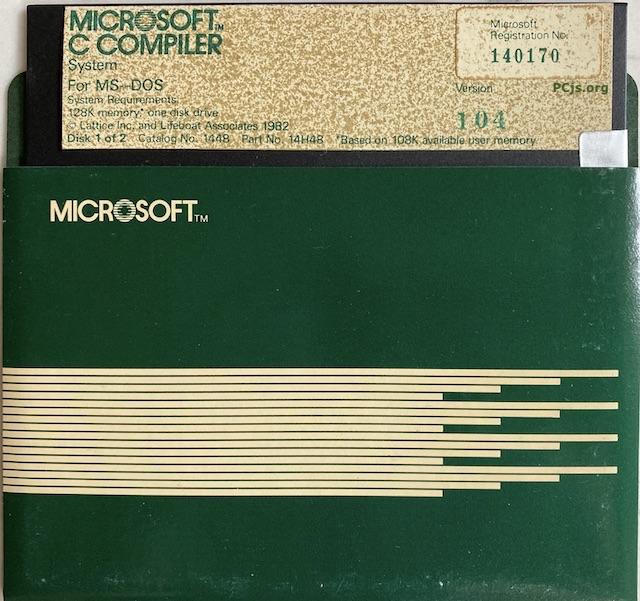
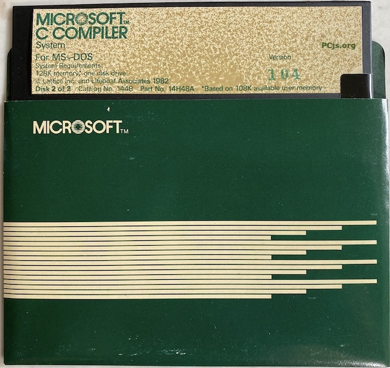

# Compilador Microsoft C 1.04
## Lançado em 1983 pela Microsoft
### Para DOS

Microsoft C 1.0 e 2.0 são uma versão renomeada do Lifeboat
Associates Lattice C. 2.0 adiciona suporte a modelos grandes.

Versões posteriores foram inteiramente da Microsoft.

O arquivo inclui duas imagens de disquete de 5,25" e 160k.

Fonte:
https://www.pcjs.org/software/pcx86/lang/microsoft/c/1.04/