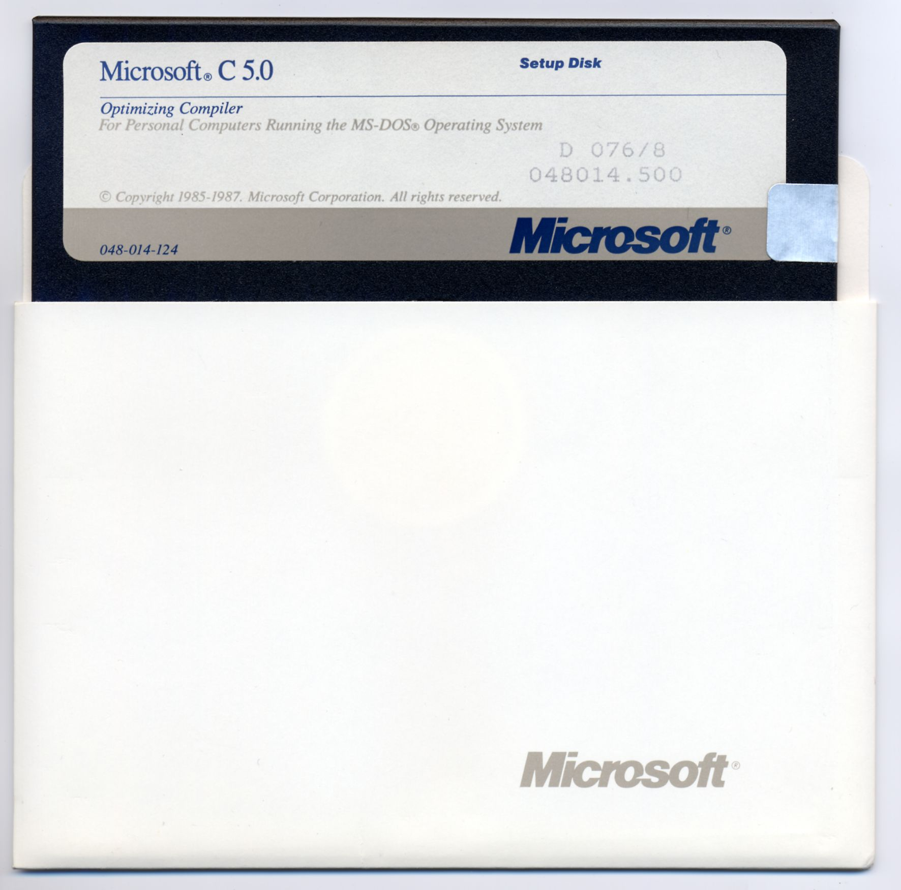
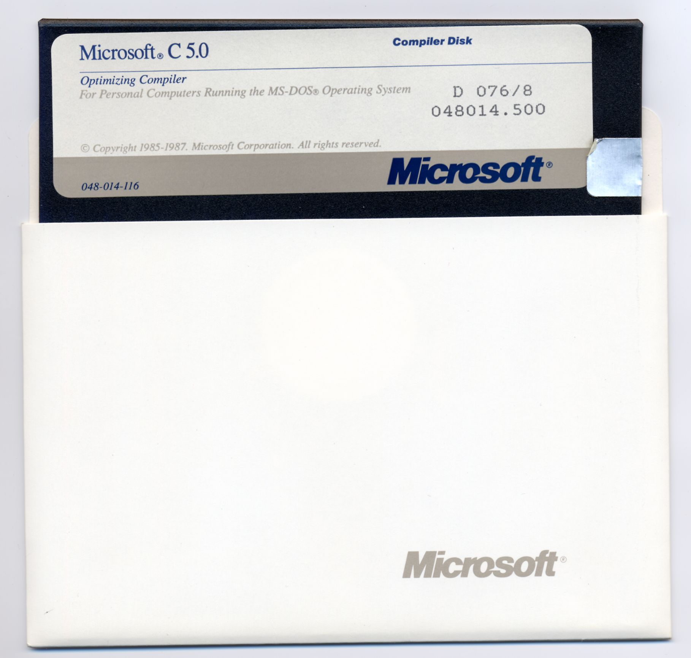
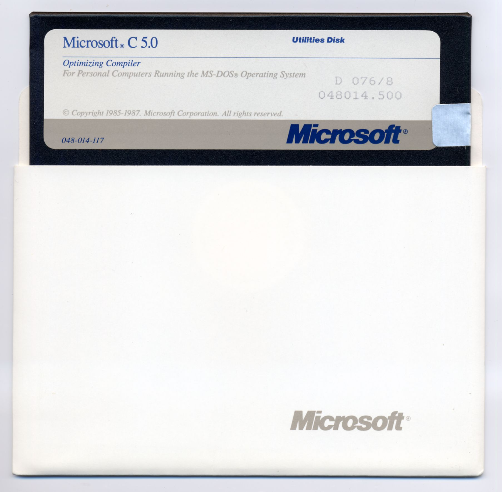
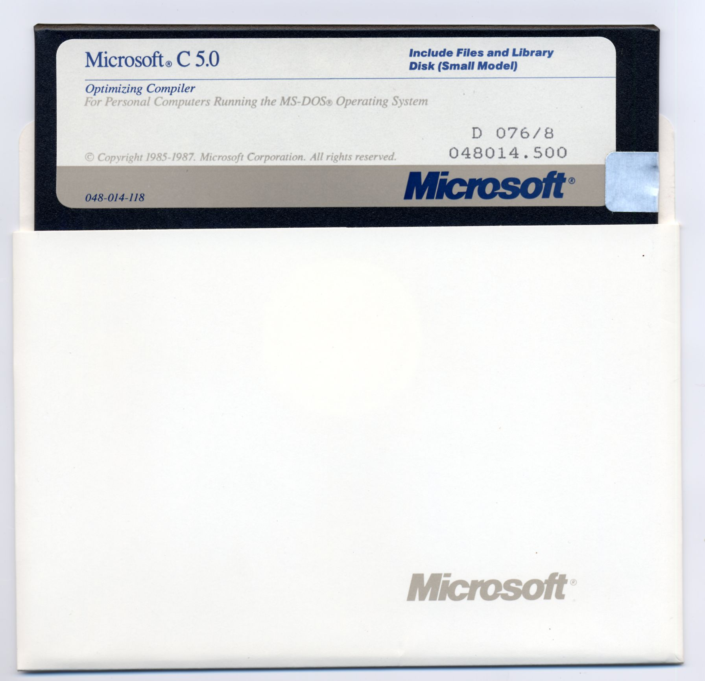
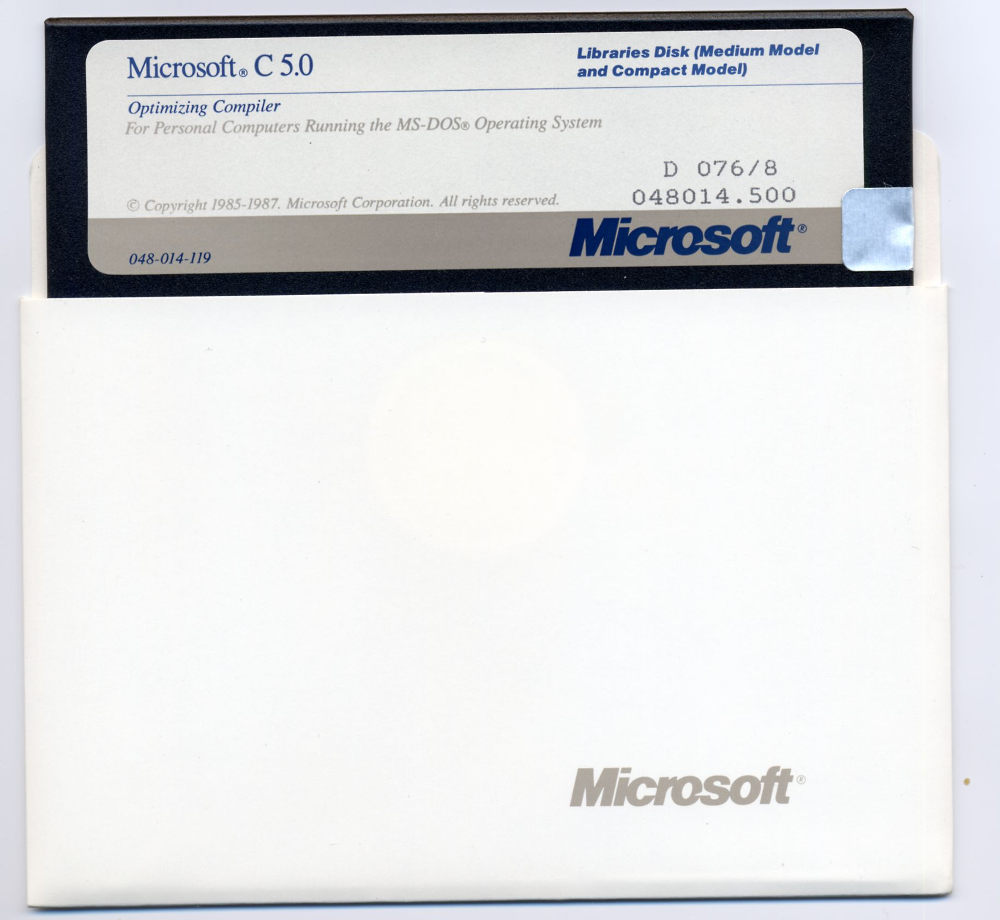
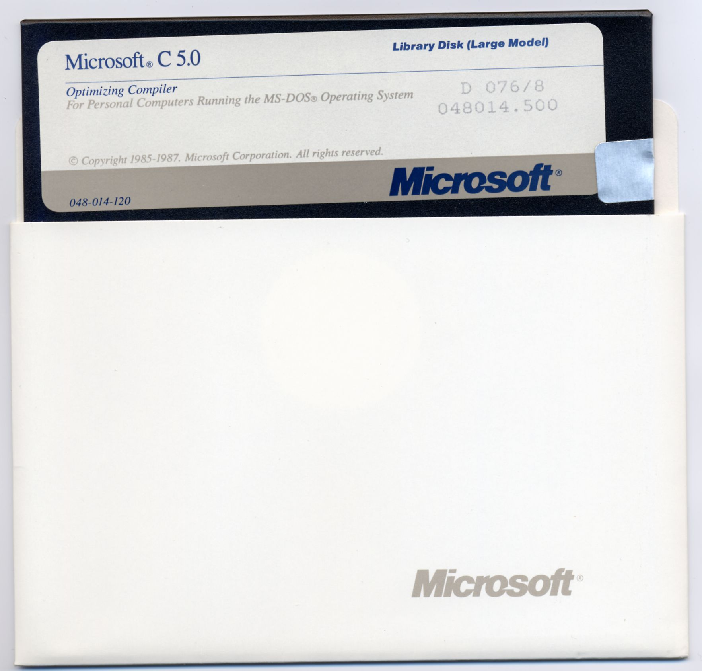
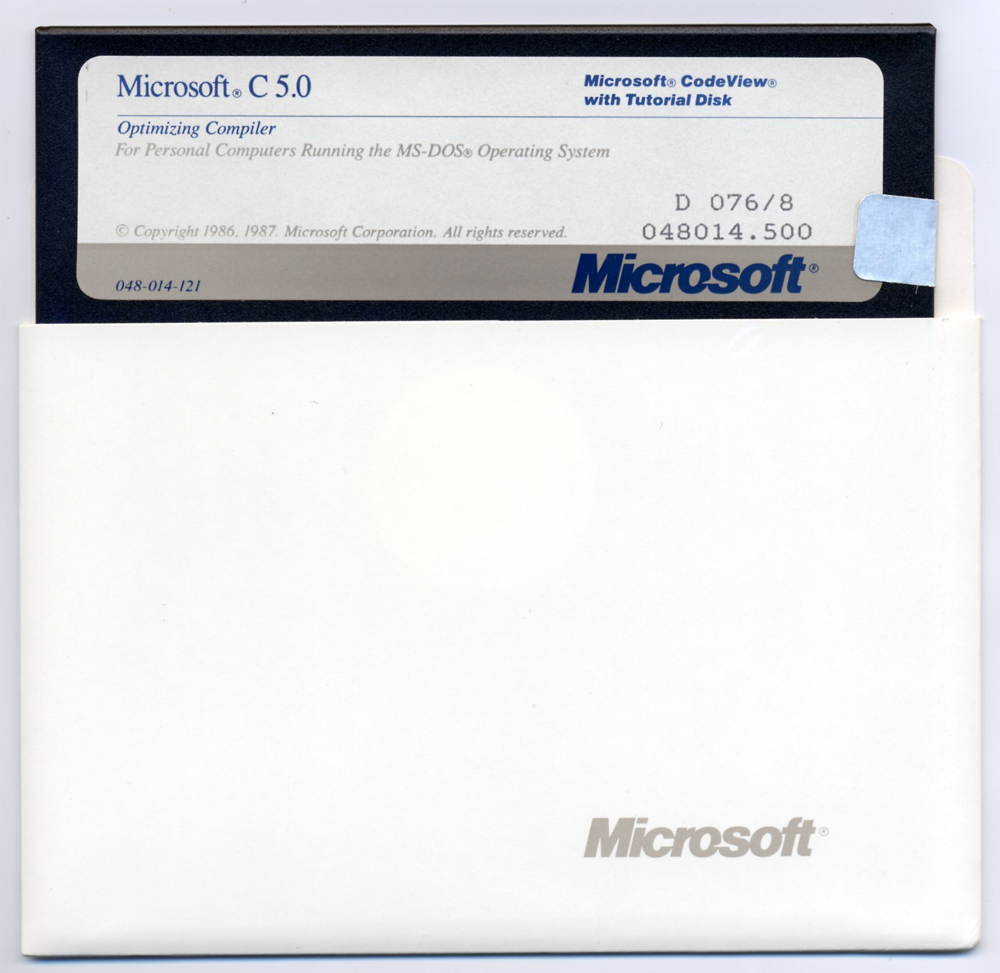
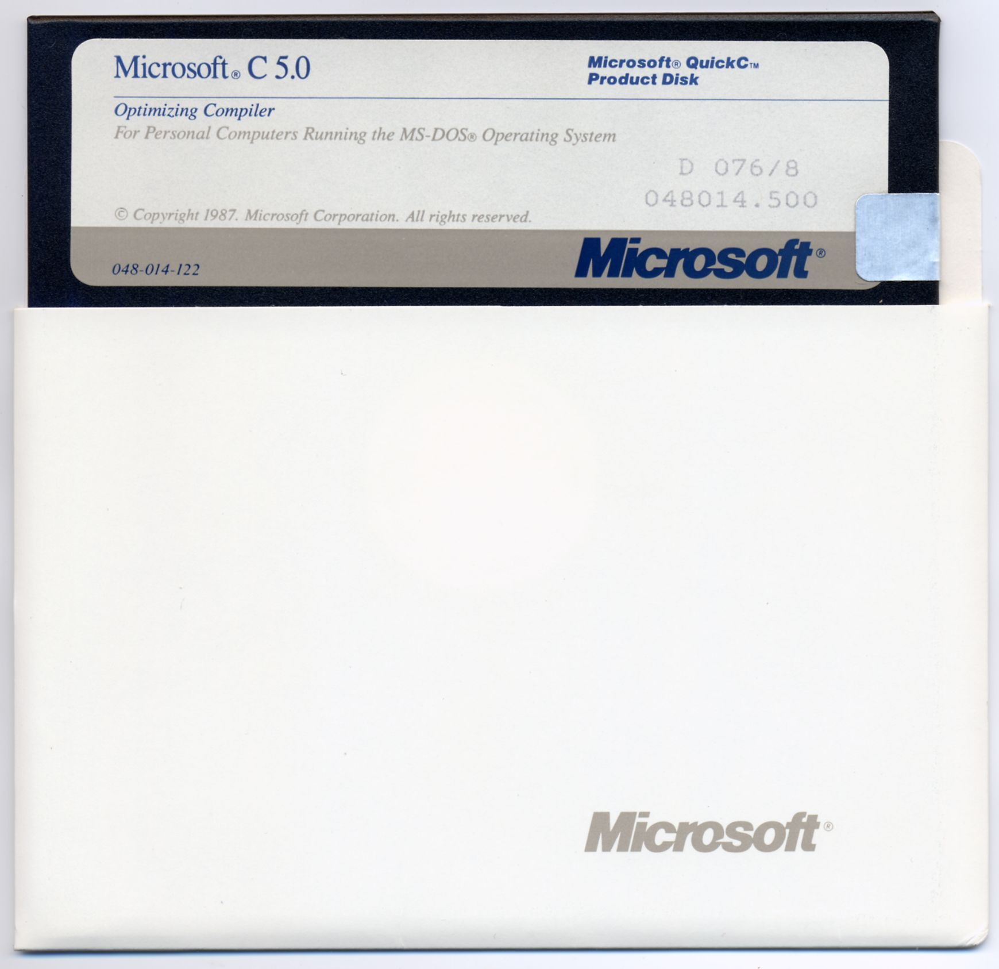
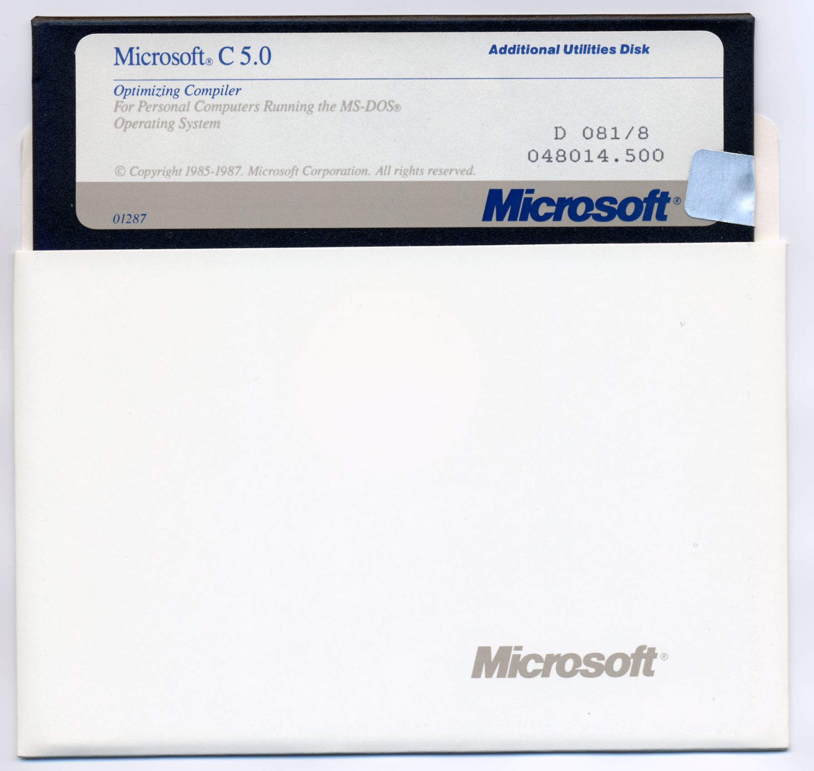

# Microsoft C 5.0
## Lançado em 1987 pela Microsoft
### Para DOS

Este é o compilador autônomo original do Microsoft C/C++ para DOS e
Windows - Versões posteriores foram renomeadas e renumeradas como Microsoft
Visual C++ e foram empacotados com o Visual Studio ou os SDKs.

Notas:

Os discos foram verificados usando o ImageDisk em execução no MS-DOS 6.2 em um
Computador 386SX25 com uma unidade de disquete Tandon 360k 40T 5 1/4 polegadas.

Nenhum erro foi relatado durante a imagem. Todos os discos tinham seus
tampas de proteção contra gravação intactas.

SETUP.IMD Disco 1 048-014-124 Disco de Configuração
COMPILER.IMD Disk 2 048-014-116 Disco do Compilador
UTILITES.IMD Disk 3 048-014-117 Utilities Disk
INCLIBSM.IMD Disk 4 048-014-118 Incluir arquivos e disco de biblioteca (modelo pequeno)
LIB_M_C.IMD Disk 5 048-014-119 Disco de Bibliotecas (Modelo Médio e Modelo Compacto)
Disco LIB_L.IMD 6 048-014-120 Disco de Biblioteca (Modelo Grande)
CODEVIEW.IMD Disk 7 048-014-121 Microsoft CodeView com Tutorial Disk
QUICK_C.IMD Disk 8 048-014-122 Microsoft QuickC Product Disk
Disco ADDNUTIL.IMD 9 01287 Disco de Utilitários Adicionais